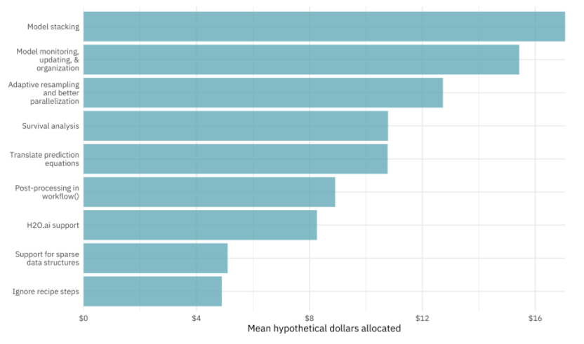
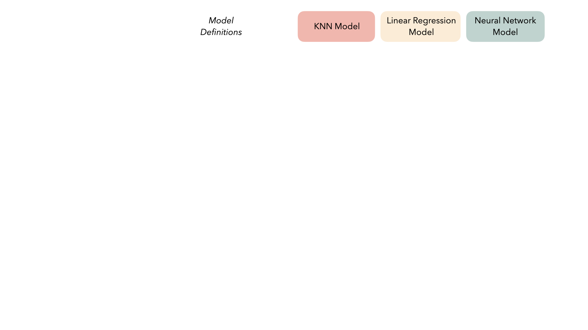
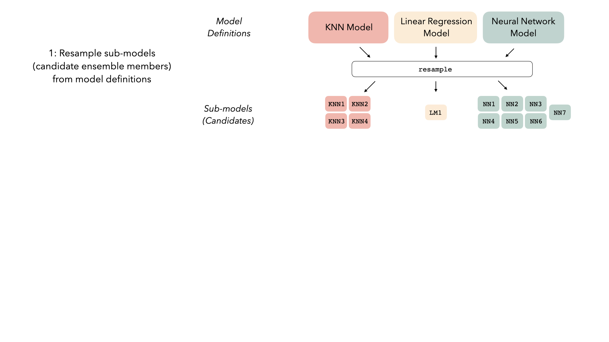
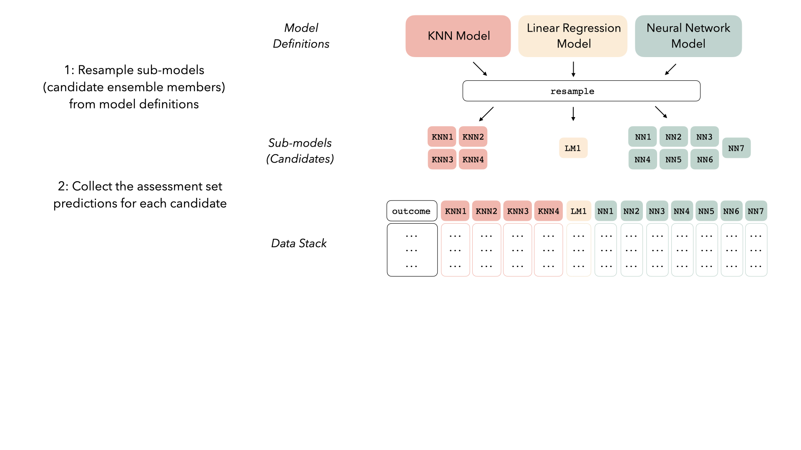
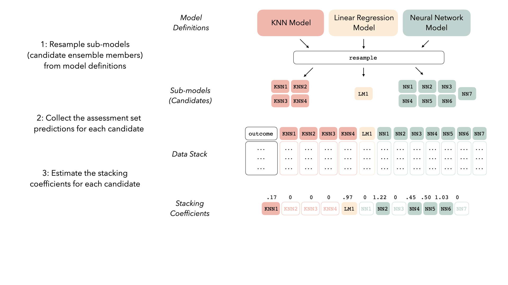
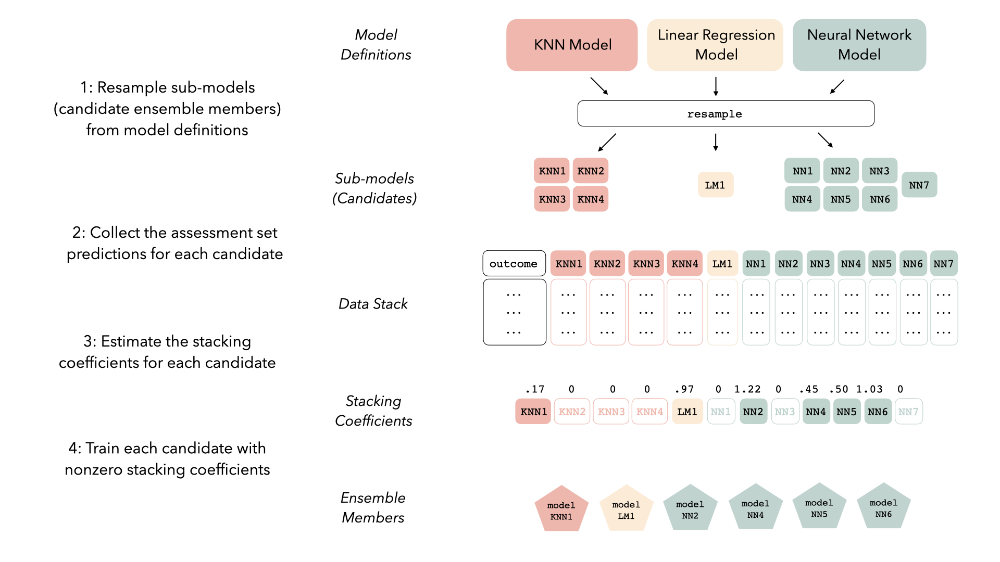

```{r knitr, include = FALSE}
library(MASS)
library(knitr)
opts_chunk$set(digits = 3, fig.path = "images/")
library(tidymodels)
library(stacks)
library(rules)
library(discrim)
library(kableExtra)
library(glmnet)
library(doMC)
registerDoMC(cores = 10)

hexes <- function(x) {
  x <- rev(sort(x))
  bad_svg <- c("dplyr", "tidyr")
  x <- ifelse(x %in% bad_svg, paste0(x, ".png"), paste0(x, ".svg"))
  markup <- function(pkg) glue::glue('')
  res <- purrr::map_chr(x, markup)
  paste0(res, collapse = "")
}

thm <- theme_bw() + 
  theme(
    panel.background = element_rect(fill = "transparent", colour = NA), 
    plot.background = element_rect(fill = "transparent", colour = NA),
    legend.position = "top",
    legend.background = element_rect(fill = "transparent", colour = NA),
    legend.key = element_rect(fill = "transparent", colour = NA)
  )
theme_set(thm)
options(width = 110)
```


class: title-slide, middle, center


# Stack'Em High! <br> Ensembles Using tidymodels

##  Max Kuhn, Simon Couch

---
# Ensemble Models

.pull-left[

We typically think of models like random forest or boosting models when we talk about ensemble methods. 

 * These are combinations of the _same type_ of model (e.g. trees).

There is a more general type of ensemble that blends _different types_ of models into an ensemble. 

Breiman's [_model stacking_](https://scholar.google.com/scholar?hl=en&as_sdt=0%2C7&q=model+stacking+breiman&btnG=&oq=%22model+stacking%22+breiman) is a very early type of general ensembling technique. 

We'll talk about linear stacking methods using the tidymodels framework in R via the new [`stacks`](https://github.com/tidymodels/stacks) package. 

To illustrate, we'll walk through the main steps in creating a _model stack_. 

]

.pull-right[

```{r survey, echo = FALSE}

```
]

---
# Step 1: Define Multiple Models of Interest `r I(hexes(c("parsnip")))`

```{r model-spec-diagram, echo = FALSE, out.width="90%", fig.align="center"}

```

---
# Step 1: Define Multiple Models of Interest `r I(hexes(c("parsnip", "tune", "discrim", "rules", "rsample", "recipes")))`

See [this file]() for all of the details for seven models.  


.pull-left[
Preliminary objects: 
```{r}
library(tidymodels)
library(stacks)
library(rules)
library(discrim)

data(cells)
cells <- cells %>% select(-case)

set.seed(4595)
data_split <- initial_split(cells, strata = "class")
cell_train <- training(data_split)
cell_test  <- testing(data_split)
```
] 

.pull-right[
Two example model specifications:
```{r specs}
ranger_spec <-
  rand_forest(mtry = tune(), min_n = tune(), 
              trees = 1000) %>%
  set_mode("classification") %>%
  set_engine("ranger")
  
  

nb_recipe <-
  recipe(formula = class ~ ., data = cell_train) %>%
  step_YeoJohnson(all_predictors())

nb_spec <-
  naive_Bayes(smoothness = tune()) %>%
  set_mode("classification") %>%
  set_engine("klaR")

nb_workflow <-
  workflow() %>%
  add_recipe(nb_recipe) %>%
  add_model(nb_spec)
```

]

---
# Step 2: Resample or Tune the Models `r I(hexes(c("tune")))`

```{r model-resample-diagram, echo = FALSE, out.width="90%", fig.align="center"}

```

---
# Step 2: Resample or Tune the Models `r I(hexes(c("tune")))`


.pull-left[
```{r fits, cache = TRUE, message = FALSE}
ctrl <- control_grid(save_workflow = TRUE, 
                     save_pred = TRUE)

set.seed(2453)
folds <- vfold_cv(cell_train) 
perf_metrics <- metric_set(roc_auc)

set.seed(41063)
ranger_tune <-
  ranger_spec %>% 
  tune_grid(
    class ~ .,
    resamples = folds,
    grid = 25,
    metrics = perf_metrics,
    control = ctrl
  )
```
] 
.pull-right[
```{r, message = FALSE, warning = FALSE, cache = TRUE}
set.seed(21575)
nb_tune <-
  tune_grid(
    nb_workflow,
    resamples = folds,
    grid = 10,
    metrics = perf_metrics,
    control = ctrl
  )
```

]

```{r models, include = FALSE}
load("cell_models.RData")
```

---
# Step 2: Resample or Tune the Models `r I(hexes(c("tune")))`

.code95[

.pull-left[
```{r ranger-resamps}
collect_metrics(ranger_tune, summarize = FALSE)
```
]
.pull-right[
```{r ranger-pred}
collect_predictions(ranger_tune) %>% 
  arrange(.config, .row)
```
]

]

---
# Step 2: Resample or Tune the Models `r I(hexes(c("tune")))`

```{r model-stats, echo = FALSE, results = 'asis'}
mod_summary <- function(x) {
  perf <- collect_metrics(x)
  p <- nrow(perf)
  wflow <- .get_tune_workflow(x)
  mod <- pull_workflow_spec(wflow) %>% class() %>% pluck(1)
  perf %>% 
    arrange(desc(mean)) %>% 
    dplyr::slice(1) %>% 
    dplyr::rename(`Largest ROC AUC` = mean) %>% 
    mutate(Model = mod, `Sub-Models` = p) %>% 
    dplyr::select(Model, `Largest ROC AUC`, `Sub-Models`)
}

bind_rows(
  mod_summary(c5_tune),
  mod_summary(glmnet_tune),
  mod_summary(ranger_tune),
  mod_summary(fda_tune),
  mod_summary(nb_tune),
  mod_summary(svm_tune)
) %>% 
  arrange(Model) %>% 
  kable(digits = 4) %>% 
  kable_styling()
```


---
# Step 3: Collate the Out-of-Sample Predictions

```{r model-pred-diagram, echo = FALSE, out.width="90%", fig.align="center"}

```

---
# Step 3: Collate the Out-of-Sample Predictions `r I(hexes(c("stacks")))`

```{r collate, cache = TRUE, warning = FALSE}
predictions <- 
  stacks() %>% 
  add_candidates(c5_tune) %>%
  add_candidates(glmnet_tune) %>%
  add_candidates(ranger_tune) %>%
  add_candidates(fda_tune) %>%
  add_candidates(nb_tune) %>% 
  add_candidates(svm_tune)
predictions
```

---
# Step 4: Fit the Ensemble Model


```{r model-blend-diagram, echo = FALSE, out.width="90%", fig.align="center"}

```


---
# Step 4: Fit the Ensemble Model  `r I(hexes(c("stacks")))`

.code95[

.pull-left[

```{r blend-model}
ens_model <- blend_predictions(predictions)
ens_model
```

]

.pull-right[

The ensemble equation is saved as an expression so only the member prediction columns are required: 

```r
stats::binomial()$linkinv(
  -(
    -2.10099262632315 + 
      (.pred_WS_c5_tune026    * 0.00228350891432108) + 
      (.pred_WS_c5_tune032    * 0.392004897857771) + 
      (.pred_WS_c5_tune080    * 0.036444840469837) + 
      (.pred_WS_c5_tune119    * 0.50171218008217) + 
      (.pred_WS_c5_tune131    * 0.324206144699012) + 
      (.pred_WS_c5_tune133    * 0.236571695996249) + 
      (.pred_WS_ranger_tune11 * 1.07510157259713) + 
      (.pred_WS_ranger_tune15 * 0.559608803598168) + 
      (.pred_WS_fda_tune25    * 0.627116371275035)
  )
)
```

These are evaluated in a `dplyr::mutate()` when `predict()` is called. 

]

]

---
# Step 4: Fit the Ensemble Model  `r I(hexes(c("stacks", "ggplot2")))`

.pull-left[
```{r plot-model, fig.width=5, fig.height=5.25,  out.width = '80%', fig.align='center', dev = 'svg', dev.args = list(bg = "transparent")}
autoplot(ens_model)
```
]
.pull-right[
```{r plot-weights, fig.width=5, fig.height=5.25,  out.width = '80%', fig.align='center', dev = 'svg', dev.args = list(bg = "transparent")}
autoplot(ens_model, type = "weights")
```
]

---
# Step 5: Fit the Constituent Models  `r I(hexes(c("stacks")))`


```{r model-members-diagram, echo = FALSE, out.width="90%", fig.align="center"}

```


---
# Step 5: Fit the Constituent Models  `r I(hexes(c("stacks")))`

.code97[

```{r member-fits}
ens_model <- fit_members(ens_model)

ens_model %>% 
  predict(cell_test, type = "prob") %>% 
  slice(1:5)

# Use the option `members = TRUE` to get the predictions for the nine ensemble members

ens_model %>% 
  predict(cell_test, type = "prob", members = TRUE) %>% 
  select(contains("WS")) %>% 
  slice(1:5)
```

]

---
# Thanks!

Thank you for the invitation to speak!

Slides are at [`https://github.com/topepo/2020-r-pharma`](https://github.com/topepo/2020-r-pharma). 

Title art by [Luke Pennystan](https://unsplash.com/photos/09FcOqmi8R0).


